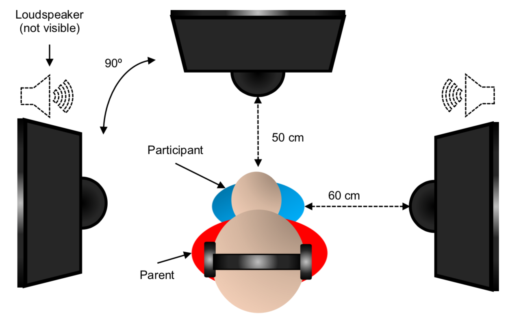
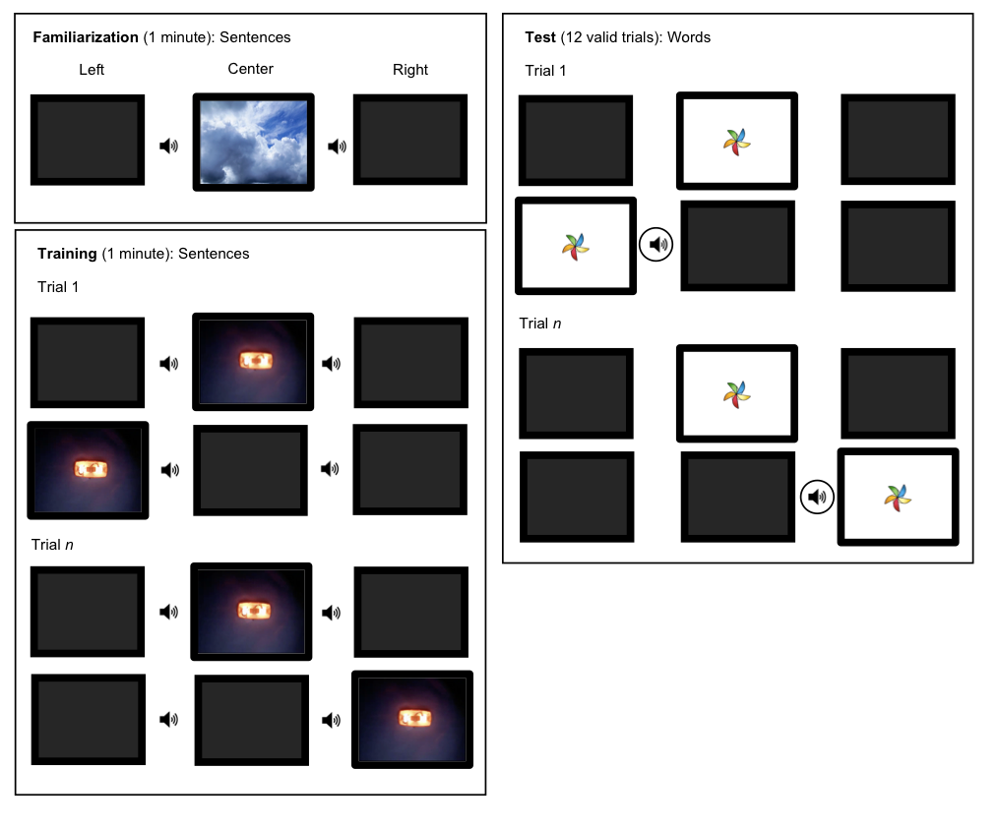

```{r setup, include = FALSE}
library(papaja)
library(bookdown)
library(knitr)     # for nice tables
library(magrittr)  # for pipes
library(dplyr)     # for manipulating data
library(tidyr)     # for manipulating datasets
library(forcats)   # for working with categorical variables
library(ggplot2)   # for visualising data
library(TOSTER)    # for equivalence testing
library(patchwork) # for arranging plots
```

```{r setup_params, include=FALSE, cache=FALSE}
knitr::opts_chunk$set(
  echo      = TRUE,
  include   = TRUE,
  fig.show  = TRUE,
  cache     = FALSE,
  results = "asis"
)


#### set up ######################################################

# set parameters
alpha      <- 0.05 # significance criterion
beta       <- 0.80 # desired statistical power
max.bil    <- 80   # maximun dominance for being bilingual
min.mon    <- 80   # minimun dominance for being monolingual
min.trials <- 8    # minimum number of test trials
min.time   <- 2000 # mimimum trial looking time
outlier.sd <- 2.5  # standard deviation for considering outliers
sesoi      <- 0.5  # smallest effect size of interest
set.seed(888)      # for reproducibility

#### import data #################################################

# long raw data
data <- read.table("Data/01_processed.txt") %>%
  mutate(logtime = log10(time)) %>%
  as_tibble()

# wide processed data
data.agg <- read.delim("Data/02_aggregated.txt")

# long raw, non-max out data
data.max <- data %>%
  filter(time <= 17000) %>%
  group_by(participant, condition, item, trial_type) %>%
  summarise(time = mean(time, na.rm = TRUE),
            n    = n())

# wide processed, non-max out data
data.max.agg <- data %>%
  filter(time <= 17000) %>%
  group_by(participant, condition, trial_type) %>%
  summarise(time = mean(time, na.rm = TRUE)) %>%
  spread(trial_type, "time") %>%
  mutate(
    difference = novel-familiar,
    proportion = novel/(novel+familiar)*100
  )

# summary data by trial type
data.summary <- data.agg %>%
  summarise(
    n    = n(),
    mean_novel    = mean(novel),
    mean_familiar = mean(familiar),
    sem_novel     = sd(novel)/sqrt(n),
    sem_familiar  = sd(familiar)/sqrt(n),
  )

excluded <- read.delim("Data/01_processed-excluded.txt") %>%
  summarise(
    interference = sum(interference),
    few_trials   = sum(few_trials),
    linguistic_profile = sum(linguistic_profile),
    incomplete = sum(incomplete),
    experimental_failure = sum(experimental_failure),
    interference = sum(interference),
    health_issues = sum(health_issues)
    ) %>%
  as.vector()

#### define variables ########################################

# sample sizes 
n                <- nrow(data.agg)
participant.data <- count(data.agg, condition, language, sex)
n.sex            <- participant.data %>%
  select(language, condition, sex, n) %>%
  group_by(sex) %>%
  summarise(n = sum(n))

# ages
age.language <- data.agg %>%
  group_by(profile, language) %>%
  summarise(
    n = n(),
    mean = mean(age),
    min = min(age),
    max = max(age)
  )
age.profile <- data.agg %>%
  group_by(profile) %>%
  summarise(
    n = n(),
    mean = mean(age),
    min = min(age),
    max = max(age)
  )

dominance <- data.agg %>%
  group_by(profile, language) %>%
  summarise(
    mean = mean(dominance),
    min = min(dominance),
    max = max(dominance)
  )

#### equivalence testing #####################################

tost <- read.delim("Data/04_analysis.txt") %>%
  mutate(p = printp(p))
power <- powerTOSTpaired(
  alpha           = alpha, 
  N               = n,
  low_eqbound_dz  = -sesoi,
  high_eqbound_dz = sesoi
)
```

# Introduction

We used an adaptation of @jusczyk1995's Head-turn Preference Procedure to investigate how 8 months-old infants react when listening a familiar word when one phoneme has been changed. In the familiarisation phase, infants listened for 2 minutes to several sentences in their dominant language (either Catalan or Spanish). The sentences embedded a made-up word (*gon*, *mus*, *for*, or *pul*). Half of the infants listened to sentences embedding *gon* and *mus*, whereas the other half listened to sentences embedding for and pul. In the test phase, all infants listened to the four words in isolation. Two of them were familiar, two of them were unfamiliar. At the beginning of each trial of the test phase, a rotating pinwheel was displayed in the central screen to grab the infant’s attention. Once the infant fixated the pinwheel, the pinwheel disappeared from the central screen and appeared randomly in either the right or the left screen. Once the infant fixated at the side pinwheel, one of the four words was played repeatedly with 0.5 seconds interval between repetitions until the infant looked away for more than 2 seconds. At this point, the pinwheel disappeared and the word stopped being played, finishing the trial. In each trial, the experimenter coded on-line how long the infant looked to the pinwheel while the word was being played. We compared infants’ looking time in trials in which a familiar word was played and in trials in which an unfamiliar word was played. Differences in looking time towards familiar vs. unfamiliar words would suggest that infants recognised familiar words. 

Familiar words were presented in the test phase exactly as they were presented in the familiarisation phase. We will also compare monolinguals vs. bilinguals, while controlling the potential effect effect of the randomisation infants were allocated in (infants familiarised with *gon* and *mus* vs. infants familiarised with *for* and *pul*). Our hypothesis is that both monolinguals and bilinguals will look different times to familiar and unfamiliar words, independently of the randomisation.

**Hypothesis**: Looking times to familiar vs. unfamiliar words will be different, regardless of linguistic profile (monolinguals vs. bilinguals) and randomization (*gon*-*mus* vs. *for*-*pul*).

# Methods
 
## Participants

We collected data from `r n` full-term 8-month-old infants (`r n.sex$n[1]` females) with no history of hearing, motor, or vision problems according to parents’ report. The accepted age range for collecting participants was from 7;15 to 9 months (261-280 days). Participants were recruited from private clinics in the Metropolitan area of Barcelona (Spain). Informed consent was obtained prior to any procedure. Socioeconomic status and linguistic environment were assessed using a detailed questionnaire as in @bosch2001. Infants with equal or longer exposure than `r min.mon`% of the total time to one of their languages were considered monolinguals while those exposed less than `r max.bil`% of the total time to one of their languages were considered bilingual.

`r printnum(age.profile$n[2], numerals = FALSE, capitalize = TRUE)` monolinguals (Mean age = `r round(age.profile$mean[2], 2)` days, range = `r round(age.profile$min[2], 2)`-`r round(age.profile$max[2], 2)` days) from monolingual Catalan (*n* = `r age.language$n[3]`) and Spanish (*n* = `r age.language$n[4]`) environments, and `r age.profile$n[1]` bilinguals (Mean age = `r round(age.profile$mean[1], 2)` days, range = `r round(age.profile$min[1], 2)`-`r round(age.profile$max[1], 2)` days), from Catalan-dominant (*n* = `r age.language$n[1]`) and Spanish-dominant (*n* = `r age.language$n[2]`) environments were included in the final analysis. Mean exposure to dominant language was `r round(dominance$mean[3], 3)`% (range = `r round(dominance$min[3], 3)`-`r round(dominance$max[3], 3)`%) in the Catalan monolingual group, `r round(dominance$mean[4], 3)`% (range = `r round(dominance$min[4], 3)`-`r round(dominance$max[4], 3)`%) in the Spanish monolingual group, `r round(dominance$mean[1], 3)`% (range = `r round(dominance$min[1], 3)`-`r round(dominance$max[1], 3)`%) in the Catalan-dominant bilingual group, and `r round(dominance$mean[4], 3)`% (range = `r round(dominance$min[4], 3)`-`r round(dominance$max[4], 3)`%) in the Spanish-dominant bilingual group. `r printnum(sum(excluded), numerals = FALSE, capitalize = TRUE)` additional participants were excluded due to health-related issues (*n* = `r excluded$health_issues`), unsuitable linguistic profile (*n* = `r excluded$linguistic_profile`), experimental failure (*n* = `r excluded$experimental_failure`), failure to reach the minimum number of `r min.trials` valid test trials (*n* = `r excluded$few_trials`), no reaching the test phase (*n* = `r excluded$incomplete`), or parental interference (*n* = `r excluded$interference`). Parental educational attainment is presented in Appendix 1.

## Stimuli

We used four target nonce words: *gon*, *mus*, *for*, and *pul*, taken from @marimon2015. Half of the words contained the /o/ phoneme (*gon*, *for*) and the other half contained the /u/ phoneme (*mus*, *pul*), both contrastive in Catalan and Spanish. None of those words exist in Spanish^[The word *mus* actually exists. It is a card game. However, infants are extremely unlikely to be familiar with this word.]. All word phonemic onset involved a consonant, as infants have been shown to start segmenting words starting with consonants earlier than words starting with vowels [@mattys2001]. We created six different sentences for each target word. The position of the target word within the sentences was counterbalanced so every passage grouped sentences containing the target words at the initial (2), middle (2) and final (2) positions.

### Stimuli recording and editing

For each word we created 7 different passages combining the same 6 sentences, separated by 1 second. Within each passage, the order of the sentences was randomised using a randomizer [link](www.random.org). The sentences were concatenated in random order with one constraint: the last sentence of one passage should not be the same as the first of the next passage, to avoid the same sentence to be repeated consecutively. The order of the resulting passages was the same in both languages. The passages were presented in the same order to all infants in the same condition.

Natural exemplars of each word were produced by a highly competent Catalan/Spanish bilingual female and recorded in a sound attenuated room with a multi-pattern condenser microphone. The talker was asked to read the stimuli while not emphasizing the target non-words. The same talker recorded all stimuli in a single session. Words were digitized, down-sampled to 16 KHz and edited using Praat 6.0.37 [@praat] and Audacity software (version 2.0.5; @audacity^[Audacity® software is copyright © 1999-2018 Audacity Team Web site: https://audacityteam.org/. It is free software distributed under the terms of the GNU General Public License. The name Audacity® is a registered trademark of Dominic Mazzoni.]), saved as `.wav` files, and finally edited using Praat [version 6.0.37; @praat]. The edition pipeline for the passages consisted in the following steps: 1) Sentences were recorded (online monitoring ensured good sound quality recording), 2) silences at the onset and the offset of each recording were removed, 3) peak intensity intensity for each passage was normalised at 65.0 dB, 4) silences of 1000 ms duration were added at the offset of each recording, 5) sentences embedding the same word were concatenated, 6) passages of each condition were concatenated. This step resulted in four different strings: a *gon-mus* string in Catalan, a *gon-mus* string in Spanish, a *for-pul* string in Catalan, and a *for-pul* string in Spanish. Within each condition, all infants listened to the same string.

The edition pipeline for the **test words** consisted on the following steps: 1) Words were recorded individually exactly as sentences were recorded, by the same speaker, in the same session, 2) silences at the onset and the offset of each recording were removed, and 3) peak intensity of each passage was normalised at 65.0 dB. The spaces between words in the test phase was introduced by the script used to display stimuli during the experiment.

## Procedure

An adaptation of the Head-turn Preference Procedure was used to test whether infants segmented the target words from the sentences as in @jusczyk1995, and @bosch2003). Infants sat on parent’s lap in a sound-attenuated room equipped with three computer screens placed in front of, and on the two sides of the infant. The experimenter remained in an adjacent testing booth, blind to the audio stimuli (hence to the experimental condition) and coded on-line looking times using custom-designed MATLAB software (R2017b, MathWorks, Inc.; WISP - Wisconsin Infant Studies Program by Rob Olson & Jenny Saffran, UW-Madison).

Infants were familiarized with one of the two passages (based on participants’ dominant language) for two minutes; during the first minute infants heard the stimuli and watched to moving clouds presented on the central screen. During the second minute, a blinking light was displayed contingent on infant looking behavior to familiarize infants with the experimental setting. After familiarization, there were 12 test trials, three for each of the four test items, presented in random order. At the beginning of each test trial, a pinwheel was displayed on the central screen until the infant fixated on it. At that point, the experimenter signaled the central pinwheel to extinguish and one of two side-pinwheels to pop up. When infants looked at the side pinwheel, one of the target words (either one of the two familiar or unfamiliar words) was played repeatedly, with 1,500 ms in between each repetition until the infant looked away for 2,000 ms, or until cumulative 17,000 ms of looking time had elapsed.

```{r hpp, echo=FALSE, message=FALSE, warning=FALSE, paged.print=FALSE}



```

To control potential intrinsic preferences towards any of the target words, half of the infants of both monolingual and bilingual groups were familiarized with *gon* and *mus* passages (condition *gon-mus*) whereas the other half were familiarized with *for* and *pul* passages (condition *for-pul*). All infants were tested with the four words. The parent was instructed not to interact with the infant during the whole procedure (e.g., no talking, pointing) and not to look to the side screens in order to avoid the infant to follow the parent’s gaze. The parent wore noise-cancellation headphones playing loud music that masked the experimental speech stimuli.

```{r procedure, echo=FALSE, message=FALSE, warning=FALSE, paged.print=FALSE}



```

### Familiarisation phase

We created a passage of 6 sentences embedding eah word. Infants were familiarised with passages corresponding to two of the words. Hence, infants listened to two passages, what means that each infant listened to 12 different sentences, 6 embedding one word, 6 embedding the other word. The duration of each passage was similar. All infants listened to the sentences for 2 minutes. The duration of familiarisation was set according to @bosch2003. During the first minute of familiarisation, infants listened to both passages of sentences (each embedding a target word) while moving clouds were displayed in the central screen. To control any intrinsic preference toward any of the words (which may potential bias looking preferences in the test phase), we counterbalanced the familiarisation words. Half of the infants were familiarised with the words *gon* and *mus* (condition *gon-mus*), whereas the other half was familliarised with the words *for* and *pul* (condition *for-pul*).

### Training phase

During the second minute of familiarisation, infants listened agains both passages of sentences. This time, a blinking light was displayed in the central screen. When the infant fixated the blinking light, the light disappeared from the central screen and started being displayed in either the right or the left screen randomily. When the infant fixated the blinking light in the side screen at least once and stopped looking at it for at least 2 seconds, the light returned to the central screen. The aim of this minute of familiasiation is that the infants get familiar with both the side screens.

### Test phase

In the test phase, 12 trials were performed (3 for each of the 4 words). Three blocks of 12 trials were prepared. Words were separated by 2 seconds and repeated continuously in each trial until maximum of 18 seconds in each trials (7 repetitions max.). Each trial of the test phase consisted of repetitions of the same word. Words within the same trial were separated by 1,500 ms as in @bosch2013. Each trial started with the display of a visual stimulus in the central screen. When the infant looked at it, the stimulus disappeared and another one appeared in one of the side screens. A list of a random word was played from the loudspeaker in the same side. Listening time of each trial was registered. Orientation time towards the side in which stimuli were displayed was considered as listening time (a head-turn of 30º or more degrees).

For the completion of the complete trial, a minimum of 2,000 ms of looking time was set. If visual orientation towards the screen was interrupted, recording time was paused and resumed once visual contact was re-established. After 2,000 ms of ceased visual orientation, trial was stopped, considered null and a new trial began. No predictions were made about the direction of preference towards the familiar or unfamiliar stimuli.

# Results

As dependent variable, we measured looking time to the side screens for familiar versus unfamiliar words presented at test. Differences in looking time for test words were considered as indicator of discrimination. Looking times in familiar and novel trials were aggregated for each participant by computing the mean looking time for the trials of each condition. Participant-level looking times a presented in Appendix 2.

A paired *t*-test comparing novel (*Mean* = `r round(data.summary$mean_novel, 2)`, *SEM* = `r round(data.summary$sem_novel, 2)`) and familiar (*Mean* = `r round(data.summary$mean_familiar, 2)`, *SEM* = `r round(data.summary$sem_familiar, 2)`) looking times failed to reject the null hypothesis at `r alpha` significant criterion, *t*(`r round(tost$df[1], 2)`) = `r abs(round(tost$t[1], 3))`, *p* = `r tost$p[1]`, Cohen's *d* = `r abs(round(tost$d[1], 2))`. A visual inspection of the data revealed that such a lack of statistically significant differences was unlikely to be due to the looking pattern of infants tested in a specific language. Given that this test does not provide any evidence supporting the null hypothesis, we opted to follow-up this analysis with equivalance testing. We performed two one-sided paired *t*-tests, contrasting our *t* estimate against those those corresponding to the lower and upper threshold of the smallest effect size we are interested in detecting with our design. We defined such effect size as a Cohen's *d* of `r sesoi`. We based our decision in the most similar previous study we could find: @bosch2013 tested word segmentation from natural speech using a similar procedure in Catalan and Spanish monolinguals and bilinguals. The effect sizes of the contrasts comparing novel and familiar looking times approximated a Cohen's *d* of 0.5 in all groups: *d* = 0.41 for Spanish monolinguals, *d* = 0.48 for Catalan monolinguals, and *d* = 0.51 for Catalan-Spanish bilinguals. To perform this test, we used the TOSTER R package @lakens2017. We achieved a statistical power of `r round(power, 3)*100`% for both constrasts. Results are summarised below:

```{r tost, echo=FALSE, message=FALSE, warning=FALSE, paged.print=FALSE}

kable(tost,
      col.names = c("Test", "t-value", "df", "p", "d"),
      digits = 2,
      format = "latex"
)

```


```{r lt_trialType_plot, echo=FALSE, message=FALSE, warning=FALSE, paged.print=FALSE}

lt_trialType_data <- data %>%
  group_by(participant, trial_type) %>%
  summarise(time = mean(time, na.rm = TRUE))

lt_trialTypeLanguage_data <- data %>%
  group_by(participant, language, trial_type) %>%
  summarise(time = mean(time, na.rm = TRUE))

ggplot(lt_trialType_data, aes(x = trial_type, y = time, fill = trial_type)) +
  geom_violin(alpha = 0.7, colour = NA) +
  geom_boxplot(fill = "white", colour = "black", width = 0.25) +
  geom_point(size = 3, alpha = 0.5) +
  labs(x = "Trial type", y = "Looking time (ms)", colour = "Trial type", fill = "Trial type") +
  scale_colour_brewer(palette = "Dark2") +
  scale_fill_brewer(palette = "Dark2") +
  theme(
    panel.grid.major.y = element_line(colour = "grey", linetype = "dotted"),
    panel.grid.minor.y = element_line(colour = "grey", linetype = "dotted"),
    panel.grid.major.x = element_blank(),
    panel.grid.minor.x = element_blank(),
    panel.background = element_rect(fill = "white"),
    legend.position = "none",
    text = element_text(colour = "black", size = 12),
    axis.text = element_text(colour = "black")
  ) +
  ggplot(lt_trialTypeLanguage_data, aes(x = trial_type, y = time, fill = trial_type)) +
  facet_wrap(~language, ncol = 1) +
  geom_violin(alpha = 0.7, colour = NA) +
  geom_boxplot(fill = "white", colour = "black", width = 0.25) +
  geom_point(size = 2, alpha = 0.5) +
  labs(x = "Trial type", y = "Looking time (ms)", colour = "Trial type", fill = "Trial type") +
  scale_colour_brewer(palette = "Dark2") +
  scale_fill_brewer(palette = "Dark2") +
  theme(
    panel.grid.major.y = element_line(colour = "grey", linetype = "dotted"),
    panel.grid.minor.y = element_line(colour = "grey", linetype = "dotted"),
    panel.grid.major.x = element_blank(),
    panel.grid.minor.x = element_blank(),
    panel.background = element_rect(fill = "white"),
    legend.position = "none",
    text = element_text(colour = "black", size = 12),
    axis.text = element_text(colour = "black")
  ) +
  plot_layout(nrow = 1)
```


# Discussion

We found no evidence of word recognition in the test phase. This outcome is conflincting with previous studies.

# Acknowledgements

We thank Katia Pistrin, Xavier Mayoral and Silvia Blanch for their technical support, Alba Portet and Maria Coll for their help testing infants, and the Speech Acquisition and Perception (SAP) research group members for their valuable comments on this manuscript. We also would like to thank all the parents and infants who so generously participated in this research.

# References

```{r create_r-references, echo=FALSE, message=FALSE, warning=FALSE, paged.print=FALSE}
r_refs(file = "r-references.bib")
```

\begingroup
\setlength{\parindent}{-0.5in}
\setlength{\leftskip}{0.5in}

<div id = "refs"></div>
\endgroup


```{r echo = FALSE, results = 'asis'}
render_appendix('Appendices/appendix1.Rmd')
```


```{r echo = FALSE, results = 'asis'}
render_appendix('Appendices/appendix2.Rmd')
```


```{r echo = FALSE, results = 'asis'}
render_appendix('Appendices/appendix3.Rmd')
```

